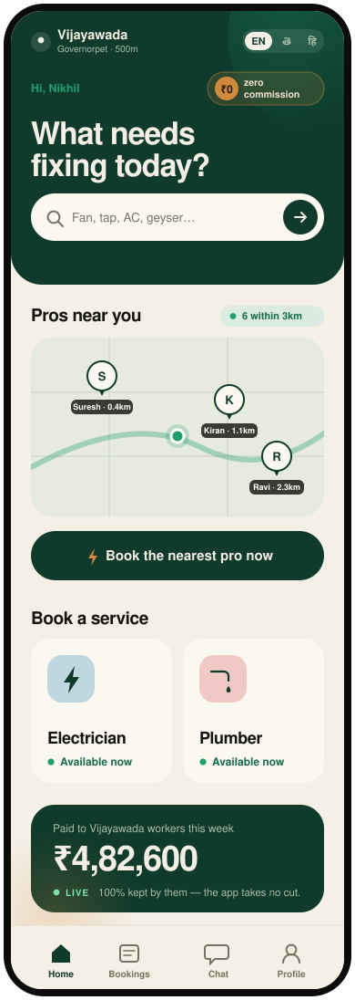
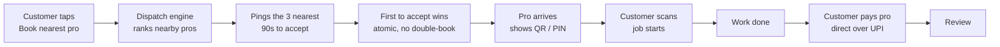
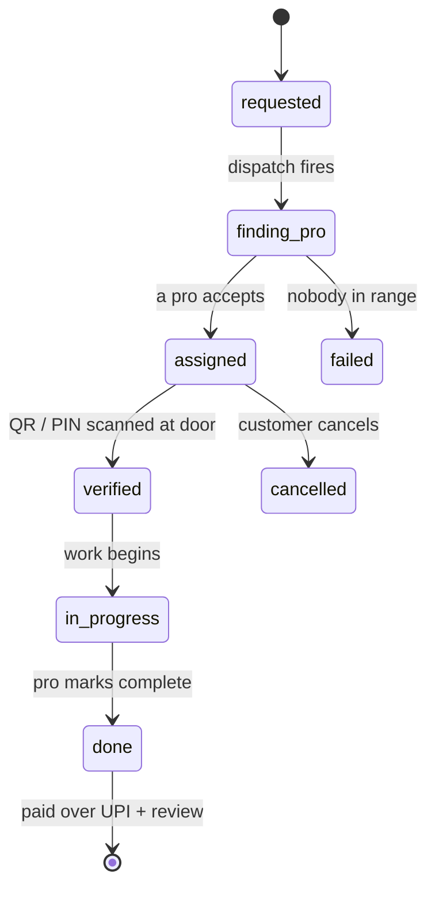

<div align="center">

# Knock

### A verified local tradesperson at your door in minutes — paid directly by you, over UPI. **Zero commission, from anyone, ever.**

India-first · Telugu-first · launching in **Vijayawada** and **Visakhapatnam**


**Live preview → [knock-kandula.vercel.app](https://knock-kandula.vercel.app)** · tap **Continue as guest** to walk the whole flow.



</div>

---

## The one sentence

> Sends a verified local tradesperson to your door in minutes, identity-checked by QR at arrival, paid directly by you, zero commission from anyone — ever.

## Why this exists

Every services marketplace in India skims the worker. A plumber does a ₹500 job; the platform keeps ₹100–150 of it and marks the customer up to cover the cut. The worker loses a fifth of every rupee, and the customer pays more so the middleman can hold the money.

Knock takes **₹0**. The customer pays the tradesperson **directly over UPI** — the app never touches the payment, never sets the price, never calls the worker an "employee". The worker keeps **100%**.

|                    | Typical marketplace | Knock          |
| ------------------ | ------------------- | -------------- |
| Commission on a ₹500 job | ₹100–150 taken   | **₹0**         |
| Who holds the money | The platform (escrow) | **Nobody** — UPI customer → pro |
| Who sets the price | The platform        | **The pro**    |
| Worker keeps        | ~70–80%             | **100%**       |

The hard part was never the payment — it's **trust without a middleman holding the cash**. That's solved at the door.

## The differentiator: trust at the doorstep

When a pro arrives, they show a **QR code (or a 4-digit PIN)**. You scan it. Only then does the job start and the status flips to `verified`. Identity, confirmed, at your door, by you — not a promise, a scanned token the server has to sign off on.

---

## Walk through one job



Every transition is enforced **server-side** in a Supabase Edge Function. A client can never forge an assignment, a "verified", a completion, a payment, or a review.

### The booking, as a state machine



Only the server writes these states. The client can request a booking and read its own, but it cannot flip `assigned`, mint a `verified`, or self-accept an offer.

---

## The dispatch engine

The core is a pure, deterministic scoring function ([`supabase/functions/_shared/dispatch.ts`](supabase/functions/_shared/dispatch.ts)) shared by the Edge Function and its unit test — one implementation, no drift. Every candidate in range gets a composite score, all factors normalized 0–1:

| Factor            | Weight | Notes |
| ----------------- | -----: | ----- |
| Rating            | **30%** | 0–5 stars; unrated pros use a neutral 0.5 prior, never zeroed |
| Distance          | **25%** | decays to 0 at the 15 km cap — nearer is better |
| Acceptance rate   | **20%** | how reliably they take offers |
| Completion rate   | **15%** | how reliably they finish |
| Recency           | **10%** | exponential decay, 7-day half-life on last activity |
| Verified bonus    | +3% | a nudge — never a bypass of the safety rules |

Two rules keep it fair and published (in the provider T&Cs, never hidden):

- **Newcomer quota** — ~20% of the first wave is reserved for pros with fewer than 5 jobs, nearest-first. A new tradesperson is never starved out by incumbents.
- **Under-rating penalty** — a rated pro below 4.0 loses a fixed 15% of score. Visible, not a silent block.

Offers go out in waves: **wave 1 = 3 pros / 90s**, **wave 2 = 5 pros / 120s** (parked, released only if wave 1 times out). First accept wins via an **atomic conditional update**, so two pros can never take the same job.

---

## Trust and safety

- **ID-checked pros** — Aadhaar + PAN before taking work. "Verified" is never shown without a completed check.
- **QR-at-the-door** — the arrival handshake is a scanned token the server validates, not a claim.
- **Safety rails** — from the moment someone is on the way until the job is finished, the booking screen carries a safety bar (share trip, emergency).
- **Auto-pause** — a provider whose rating falls below the floor is paused, a separate and visible state.
- **UPI-direct** — money moves customer → pro. No wallet, no escrow, no commission.

## Architecture

**Client** — Expo SDK 57 · React Native 0.86 · TypeScript (strict) · expo-router · Zustand + React Query · i18next. One design system in [`theme/tokens.ts`](theme/tokens.ts): re-theme the whole app by editing token values.

**Backend** — Supabase only. Postgres with **Row-Level Security on every table**, phone / email / anonymous Auth, Realtime (chat + live booking status), Storage (job photos, work galleries), and **Edge Functions for every state transition** — `dispatch`, `respond`, `verify-arrival`, `job-action`, `swap`, `submit-review`, `delete-account`. No `service_role` key in the client; anon key + RLS only.

**Security model** — the crown jewels are uid-scoped. The door token is readable by the assigned pro alone; the customer's phone by the assigned pro only while the job is live; chat by the two participants only. 21 migrations, each policy verified against the Supabase security advisor.

```
app/           expo-router routes  ·  app/(tabs) is the customer tab shell
components/    shared UI (design-system components, live map, QR)
lib/           supabase client, auth, dispatch/geo helpers, i18n, queries
theme/         design tokens — single source of truth
locales/       en / te / hi translation JSON, kept at parity
supabase/      migrations + edge functions (server-authoritative logic)
```

---

## Design — the "Doorstep" system

A confident, premium look built on one rule: **forest green is the single action on any screen, the ₹0 coin is the value.**

| Token   | Value      | Role |
| ------- | ---------- | ---- |
| forest  | `#0F3A2C`  | dark surfaces + the one CTA (pill-shaped) |
| emerald | `#1E9E6A`  | proof only — verified / available / paid |
| gold    | `#CF8A3C`  | the ₹0 coin / value |
| paper   | `#ECE7DA`  | warm ground |
| surface | `#FBF8F1`  | bright card, lifts off the ground |
| ink     | `#14150F`  | warm near-black type |

### Typography that respects three scripts

This is the part most apps get wrong. Knock gives **each language its own display face with real weight and character** — not a Latin font with the local script bolted on as an afterthought.

| Script     | Display face          | Body face            |
| ---------- | --------------------- | -------------------- |
| Latin      | Bricolage Grotesque   | Inter                |
| Telugu     | Baloo Tammudu 2       | Noto Sans Telugu     |
| Devanagari | Baloo 2               | Noto Sans Devanagari |

`components/AppText` swaps the family **and weight tier** by the active language at render, floors line-height for the matra-stacking scripts, and keeps hierarchy readable in all three. Author a style with a `font.*` token, wrap text in `AppText` — never a raw family, never a raw `Text`. Telugu is tested first: its strings run ~30% longer than English.

---

## Run it

```bash
npm install
npm run web          # browser preview on localhost:8081
npm run ios          # or android / start — needs Expo Go or a dev build
npm run check        # tsc + the dispatch engine unit test
```

Set `EXPO_PUBLIC_SUPABASE_URL` and `EXPO_PUBLIC_SUPABASE_ANON_KEY` in `.env` (see `.env.example`). The anon key is client-safe by design; RLS protects the data.

## What works today

The full loop is built and verified end-to-end: **request → dispatch → match → doorstep verify → UPI pay → review**, plus realtime chat, distance-ranked search, a provider side (offers, earnings, reviews, availability), and all three languages at parity. The web preview is live.

Remaining work is mostly account-gated, not missing code — a native store build (Apple / Play), SMS-OTP and KYC vendors, push tokens. Tracked in [`TODO.md`](TODO.md) and [`DEVICE-TEST.md`](DEVICE-TEST.md); full spec in [`services-app-master-plan.md`](services-app-master-plan.md).

## The principles it won't break

- The app **never** collects payment. UPI-direct, customer → pro. No wallet, no escrow.
- **Never** set or cap a provider's price. They are independent professionals, not employees.
- **Never** show "Verified" without a completed check.
- No `service_role` key in the client. No raw Aadhaar storage, ever.

---

<div align="center">

**Built for the workers who keep 100%.**

</div>
