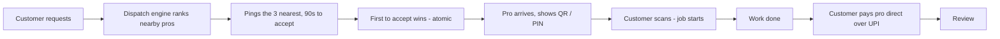

# Services App — zero-commission local trades

> A verified local tradesperson at your door in minutes, identity-checked by QR when they arrive, paid directly by you over UPI. **Zero commission, from anyone, ever.**

India-first. Telugu-first. Launching in Vijayawada and Visakhapatnam.

**Live preview:** https://services-app-kandula.vercel.app — tap **Continue as guest** to walk the whole flow.

---

## Why this exists

Every services marketplace in India skims 20–30% off the worker and marks the customer up to pay for it. This one takes **₹0**. The customer pays the tradesperson directly over UPI; the app never touches the money, never sets the price, never calls the worker an "employee". The worker keeps 100% of every rupee.

The hard part isn't the payment — it's **trust without a middleman holding the cash**. That's solved at the door: the pro shows a QR code (or a 4-digit PIN), you scan it, and only then does the job start. Identity, verified, at your doorstep, by you.

## The one sentence

> Sends a verified local tradesperson to your door in minutes, identity-checked by QR at arrival, paid directly by you, zero commission from anyone — ever.

---

## How a job flows



Every transition is **server-enforced** in a Supabase Edge Function — a client can never forge an assignment, a "verified", a completion, or a review. First-accept-wins is an atomic conditional update, so two pros can't both take one job.

## What makes it trustworthy

- **ID-checked pros** — Aadhaar + PAN verification before a pro takes work. "Verified" is never shown without a completed check.
- **QR-at-the-door** — the differentiator. The arrival handshake is a scanned token, not a promise.
- **UPI-direct** — money goes customer → pro. No wallet, no escrow, no commission.
- **Distance-honest dispatch** — pros ranked by real distance (Haversine over geohash), rating, and accept rate; one in five rounds reserved for newcomers.
- **Telugu-first** — every string ships in English, Telugu, and Hindi from day one, with per-script fonts.

---

## Architecture

**Client:** Expo SDK 57 · React Native 0.86 · TypeScript · expo-router · Zustand + React Query · i18next. One design system in `theme/tokens.ts` (re-theme the whole app by editing token values). Fraunces serif display + Inter + Noto (Telugu/Devanagari), swapped per active language at render.

**Backend:** Supabase only — Postgres with **Row-Level Security on every table**, phone/email/anon Auth, Realtime (chat + live booking status), Storage (job photos, work galleries), and Edge Functions for every state transition. No `service_role` key in the client; anon key + RLS only.

**Security model:** the crown jewels are uid-scoped — the door token is readable by the assigned pro alone, customer PII by the pro only on an active booking, chat by participants only. Verified by the Supabase security advisor and a manual policy audit.

```
app/           expo-router routes (customer tab shell in app/(tabs))
components/     shared UI (design-system components)
lib/            supabase client, auth, queries, geo/dispatch helpers, i18n
theme/          design tokens — single source of truth
locales/        en / te / hi translation JSON (kept at parity)
supabase/       migrations + edge functions (server-authoritative logic)
```

## Run it

```bash
npm install
npm run web          # browser preview at localhost:8081
npm run ios          # or android / start — needs Expo Go or a dev build
npm run check        # tsc + dispatch engine unit test
```

Set `EXPO_PUBLIC_SUPABASE_URL` and `EXPO_PUBLIC_SUPABASE_ANON_KEY` in `.env` (see `.env.example`). The anon key is client-safe by design; RLS protects the data.

## Status

The core loop is **built and verified end-to-end**: request → dispatch → match → doorstep verify → UPI pay → review, plus realtime chat and distance-ranked search. Web preview is live.

Remaining work is tracked in [`TODO.md`](TODO.md) and [`DEVICE-TEST.md`](DEVICE-TEST.md) — mostly account-gated (native store build, SMS/KYC vendors) and on-device verification, not missing code. Full product spec: [`services-app-master-plan.md`](services-app-master-plan.md).

---

*Built for the workers who keep 100%.*
